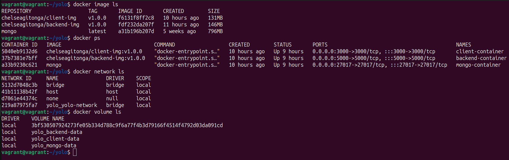
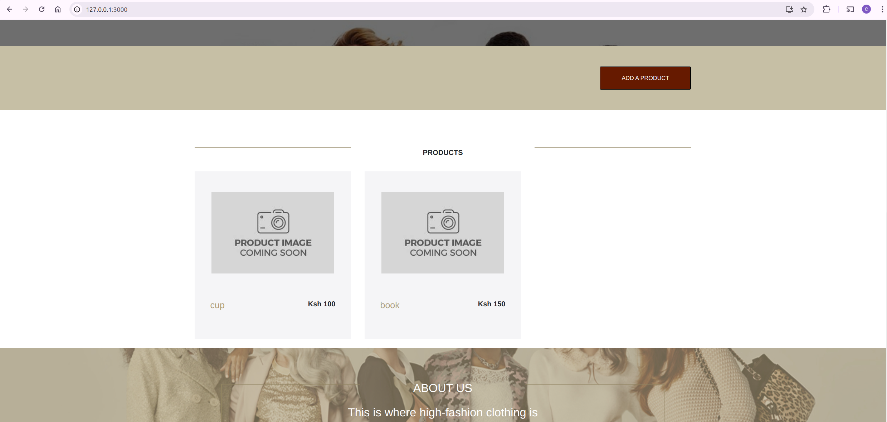

## 1. hosts
This setup allows Ansible to manage the VM created by Vagrant as if it were any other remote host.
```
[vagrant]
default ansible_host=127.0.0.1 ansible_port=2222 ansible_user=vagrant ansible_ssh_private_key_file=.vagrant/machines/default/virtualbox/private_key
```

## 2. ansible.cfg
- **inventory = hosts**: Sets hosts as the default inventory file.
- **host_key_checking = False**: Disables SSH host key checking, allowing easier connections to new or temporary hosts.
- **retry_files_enabled = False**: Disables the creation of retry files after failed playbook runs, which can help keep the working directory clean.
```
[defaults]
inventory = hosts
host_key_checking = False
retry_files_enabled = False
```

## 3. Vagrantfile
This configuration sets up a Vagrant VM using an Ubuntu 20.04 box, configures networking with port forwarding, allocates 2GB of RAM and 2 CPU cores, and provisions the VM using an Ansible playbook. The setup is tailored for developing or testing environments where services running on the VM need to be accessible from the host machine.
```
Vagrant.configure("2") do |config|
  config.vm.box = "geerlingguy/ubuntu2004"
  
  config.vm.network "private_network", type: "dhcp"
  config.vm.network "forwarded_port", guest: 3000, host: 3000
  config.vm.network "forwarded_port", guest: 5000, host: 5000
  config.vm.network "forwarded_port", guest: 27017, host: 27017

  config.vm.provider "virtualbox" do |vb|
    vb.memory = "2048"
    vb.cpus = 2
  end

  config.vm.provision "ansible" do |ansible|
    ansible.playbook = "playbook.yaml"
    ansible.verbose = "vv"
  end
end
```

## 4. playbook.yaml
An Ansible playbook that runs tasks on all hosts with elevated privileges (using become: true). The tasks are organized into roles, which is a modular way to manage configurations.
```
- hosts: all
  become: true
  roles:
    - system_updates
    - nodejs_npm
    - clone_repository
    - install_dependencies
    - docker
    - docker_compose
```

## 5. roles
- **system_updates**:
This role ensures that the system's package list is up-to-date and that all installed packages are upgraded to their latest versions.
    ```
    - name: Update package list
    apt:
        update_cache: yes

    - name: Upgrade all packages
    apt:
        upgrade: dist
    ```

- **nodejs_npm**:
This role installs Node.js and npm, the JavaScript runtime and its package manager, which are essential for running and managing Node.js applications.
    ```    
    - name: Install Node.js
    apt:
        name: nodejs
        state: present

    - name: Install npm
    apt:
        name: npm
        state: present
    ```

- **clone_repository**:
This role clones the application's source code from a Git repository, ensuring that the latest code is available on the VM.
    ```    
    - name: Clone the repository
    git:
        repo: 'https://github.com/ChelseaGitonga/yolo.git'
        dest: '/home/vagrant/yolo'
        version: 'main'
    ```

- **install_dependencies**:
This role installs additional system dependencies required by the application or environment, such as tools and libraries necessary for operation or development.
    ```
    - name: Install dependencies
    apt:
        name:
        - apt-transport-https
        - ca-certificates
        - curl
        - software-properties-common
        - python3-pip
        state: present
        update_cache: yes
    ```
- **docker**:
This role sets up Docker, a containerization platform, by installing Docker Engine and configuring the system to use it. Docker allows applications to run in isolated environments called containers.
    ```    
    - name: Add Docker GPG key
    apt_key:
        url: https://download.docker.com/linux/ubuntu/gpg
        state: present

    - name: Add Docker repository
    apt_repository:
        repo: deb [arch=amd64] https://download.docker.com/linux/ubuntu focal stable
        state: present

    - name: Update apt and install Docker
    apt:
        name: docker-ce
        state: present
        update_cache: yes

    - name: Install Docker Compose
    get_url:
        url: https://github.com/docker/compose/releases/download/1.29.2/docker-compose-Linux-x86_64
        dest: /usr/local/bin/docker-compose
        mode: '0755'

    - name: Add vagrant user to docker group
    user:
        name: vagrant
        groups: docker
        append: yes
    ```

- **docker_compose**:
This role runs Docker Compose to start the application's containers, orchestrating the setup of the backend, frontend, and database services as defined in a docker-compose.yaml file.
    ```
    - name: Start Docker Compose
    command: docker-compose up -d
    args:
        chdir: /home/vagrant/yolo
    ```
## 6. Images, Containers, Network and Volumes
**Command**: vagrant provision, then access the server terminal

Open your browser and visit the website at **http://127.0.0.1:3000**.

