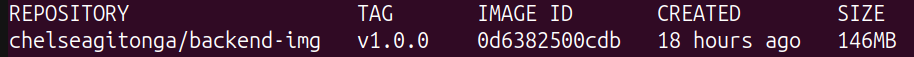
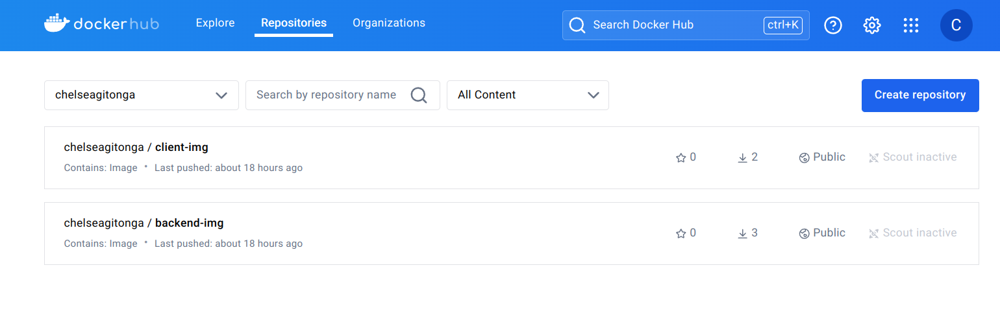
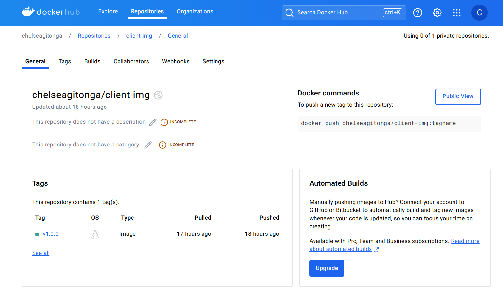
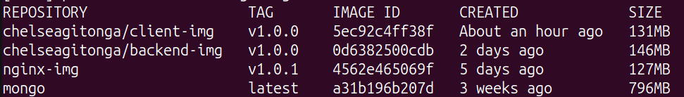
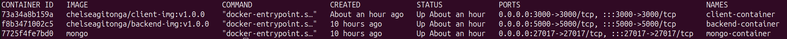
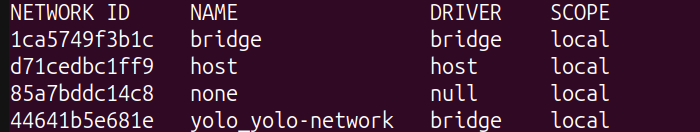
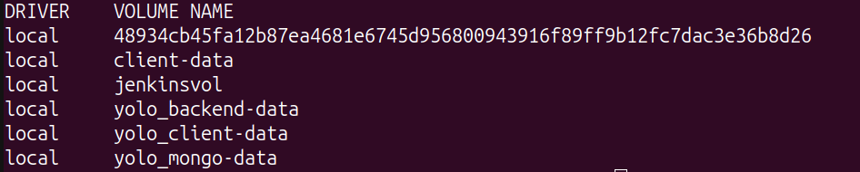

## 1. Choice of the base image on which to build each container 
Base Image: **node:16-alpine** used to build both client and backend images <br />
Reasoning: <br />
**Lightweight**: Alpine Linux is known for its small size and simplicity, which helps reduce the overall size of the docker image.<br />
**Security**: Alpine Linux has a smaller attack surface due to its minimalistic nature, which enhances security.<br />
**Performance**: Using a smaller base image can lead to faster download times and improved performance when deploying the image.<br />
**Node.js Version**: Node.js 16 was chosen because it is a Long-Term Support (LTS) version, providing stability and support for production environments.<br />
                     Node.js version 16 uses OpenSSL 1.1.1, ensuring compatibility and avoiding any Node.js and OpenSSL version conflicts.

## 2. Dockerfile directives used in the creation and running of each container:
### Backend Dockerfile:
Directives used: FROM, WORKDIR, COPY, RUN, EXPOSE, CMD


Use Node.js 16 on Alpine Linux for the build stage.<br />
 ```FROM node:16-alpine AS builder```

Set the working directory to /app.<br />
 ```WORKDIR /app```

Copy package files to the container.<br />
 ```COPY package*.json ./```

Install production dependencies.<br />
 ```RUN npm install --production```

Copy the rest of the application code.<br />
 ```COPY . .```

Start a new stage with Node.js 16 on Alpine Linux.<br />
 ```FROM node:16-alpine```

Set the working directory for the final image.<br />
 ```WORKDIR /app```

Copy built files from the build stage.<br />
 ```COPY --from=builder /app ./```

Document that the container uses port 5000.<br />
 ```EXPOSE 5000```

Define the command to run the application.<br />
 ```CMD ["npm", "start"]```

 Multi-stage build process helps keep the final docker image lean by separating the build environment from the runtime environment.<br />
 Image size:<br />
 

 Image pushed to dockerhub:
 
 

The above can be verified [here](https://hub.docker.com/repositories/chelseagitonga)

### Client Dockerfile:
Directives used: FROM, WORKDIR, COPY, RUN, EXPOSE, CMD


Use Node.js 16 on Alpine Linux for the build stage.<br />
 ```FROM node:16-alpine AS builder```

Set the working directory to /app.<br />
 ```WORKDIR /app```

Copy package files to the container.<br />
 ```COPY package*.json ./```

Install dependencies from package-lock.json for a clean build.<br />
 ```RUN npm ci```

Copy the rest of the application code.<br />
 ```COPY . .```

Build the application (e.g., create production assets).<br />
 ```RUN npm run build```

Start a new stage with Node.js 16 on Alpine Linux.<br />
 ```FROM node:16-alpine```

Set the working directory for the final image.<br />
 ```WORKDIR /app```

Install serve globally to serve static files.<br />
 ```RUN npm install -g serve```

Copy the build artifacts from the build stage.<br />
 ```COPY --from=builder /app/build /app/build```

Document that the container uses port 3000.<br />
 ```EXPOSE 3000```

Run serve to serve the built application on port 3000.<br />
 ```CMD ["serve", "-s", "build"]```

Multi-stage build process helps keep the final docker image lean by separating the build environment from the runtime environment.<br />
  Image size:<br />
  

Image pushed to dockerhub:
 
 

The above can be verified [here](https://hub.docker.com/repositories/chelseagitonga)

## 3. Docker-compose Networking (Application port allocation and a bridge network implementation) where necessary:
### Application port allocation:
Client: Port 3000<br />
Backend: Port 5000<br />
Mongo: Port 27017

### Bridge network implementation: 
In the docker-compose.yaml file, I created a custom bridge network named yolo-network. This configuration ensures that our services (client, backend and mongo) are interconnected within the same network, facilitating seamless communication.<br />

The above can be verified [here](docker-compose.yaml)


## 4. Docker-compose volume definition and usage (where necessary):
In the docker-compose.yaml file, I defined three volumes: backend-data, client-data and mongo-data using the local driver, which stores data on the Docker host's local filesystem. Although these volumes are not currently mounted, they act as placeholders for potential future data persistence needs, ensuring scalability and readiness for future requirements.

The above can be verified [here](docker-compose.yaml)

## 5. Git workflow used to achieve the task:
I have made quality descriptive commits for each development step, provided comprehensive descriptions, documented a thorough README, organized a proper folder structure and maintained a minimum of 10 commits.

The above can be verified [here](https://github.com/ChelseaGitonga/yolo/tree/main)

## 6. Successful running of the applications and if not, debugging measures applied:
`sudo docker compose build` and `sudo docker compose up` successfully created images, containers, networks and volumes as shown in the images below:<br />
Images:
<br />

Containers:
<br />

Networks:
<br />

Volumes:
<br />

"Add Product" funtionality:


