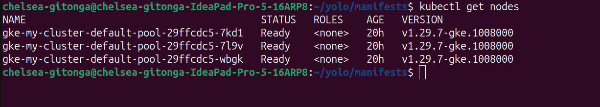
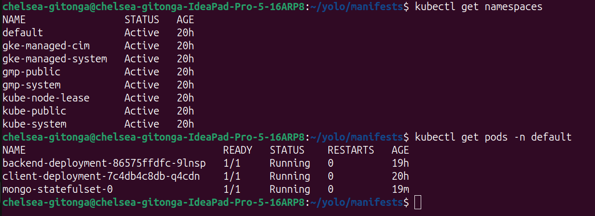
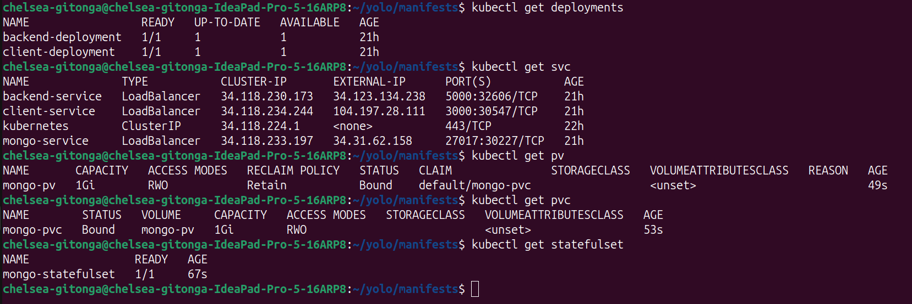

## 1. backend-deployment.yaml
This YAML configuration sets up a Kubernetes Deployment and Service for a backend application:

- **Deployment**: Creates a single pod running a container with the image `chelseagitonga/backend-img:v1.0.0`. The pod listens on port 5000 and has resource requests and limits defined. An environment variable is set to connect to a MongoDB service within the cluster.

- **Service**: Exposes the backend pod externally using a LoadBalancer, forwarding traffic from port 5000 to the pod's container. The service selects the pod based on its label `app: backend`.
```
apiVersion: apps/v1
kind: Deployment
metadata:
  name: backend-deployment
spec:
  replicas: 1
  selector:
    matchLabels:
      app: backend
  template:
    metadata:
      labels:
        app: backend
    spec:
      containers:
        - name: backend
          image: chelseagitonga/backend-img:v1.0.0
          ports:
            - containerPort: 5000
          env:
            - name: MONGODB_URI
              value: mongodb://mongo-service.default.svc.cluster.local:27017/yolo
          resources:
            requests:
              memory: "128Mi"
              cpu: "250m"
            limits:
              memory: "256Mi"
              cpu: "500m"
---
apiVersion: v1
kind: Service
metadata:
  name: backend-service
spec:
  type: LoadBalancer # This type exposes the service externally using a cloud provider's load balancer
  selector:
    app: backend # The service targets pods with the label app: backend
  ports:
    - protocol: TCP # The communication protocol used
      port: 5000 # The port exposed by the service
      targetPort: 5000 # The port on the pod that the service forwards traffic to. This should match the containerPort defined in the deployment
```

## 2. client-deployment.yaml
This YAML configuration defines a Kubernetes Deployment and Service for a client application.
This configuration deploys a client application as a single pod and exposes it externally via a LoadBalancer on port 3000. The **Deployment** manages the pod's lifecycle, while the **Service** makes the application accessible from outside the Kubernetes cluster.

```
apiVersion: apps/v1
kind: Deployment
metadata:
  name: client-deployment
spec:
  replicas: 1 # Deploys a single pod
  selector:
    matchLabels:
      app: client
  template:
    metadata:
      labels:
        app: client
    spec:
      containers: # Runs a container named `client` using the image `chelseagitonga/client-img:v1.0.0`
        - name: client
          image: chelseagitonga/client-img:v1.0.0
          ports:
            - containerPort: 3000 # The container listens on port 3000
          resources:
            requests: # Minimum memory of 128Mi and CPU of 250m
              memory: "128Mi"
              cpu: "250m"
            limits: # Maximum memory of 256Mi and CPU of 500m
              memory: "256Mi"
              cpu: "500m"
---
apiVersion: v1
kind: Service
metadata:
  name: client-service
spec:
  type: LoadBalancer # This type exposes the service externally using a cloud provider's load balancer
  selector:
    app: client # Targets the pod with the label `app: client`
  ports: # Exposes port 3000, which is mapped to the pod's container port 3000
    - protocol: TCP
      port: 3000
      targetPort: 3000
```

## 3. mongo-statefulset.yaml
This YAML configuration is designed to deploy a MongoDB instance in a Kubernetes cluster with persistent storage and stable network identity. It achieves this by using a combination of PersistentVolume (PV), PersistentVolumeClaim (PVC), StatefulSet and a Service.
- **PersistentVolume (PV):** A PersistentVolume is a piece of storage in the cluster that has been provisioned by an administrator or dynamically provisioned using Storage Classes. It is used to store data persistently, even if the pod is deleted or rescheduled.
- **PersistentVolumeClaim (PVC):** A PersistentVolumeClaim is a request for storage by a user. It can be used by pods to claim the PersistentVolume and access the storage.
- **StatefulSet:** A StatefulSet is a Kubernetes resource used to manage stateful applications. It provides guarantees about the ordering and uniqueness of pods. This is particularly useful for applications like databases, where stable network identity and persistent storage are important.
- **Service:** The Service exposes the MongoDB instance to external clients or other applications. The `LoadBalancer` type of Service creates an external IP address that forwards traffic to the MongoDB pod.

```
apiVersion: v1
kind: PersistentVolume
metadata:
  name: mongo-pv
spec:
  capacity:
    storage: 1Gi # Specifies the storage capacity of 1 Gigabyte
  accessModes:
    - ReadWriteOnce # The volume can be mounted as read-write by a single node
  hostPath:
    path: /mnt/data/mongo # The storage is backed by the host machine’s filesystem at the specified path
---
apiVersion: v1
kind: PersistentVolumeClaim
metadata:
  name: mongo-pvc
spec:
  accessModes:
    - ReadWriteOnce # Requests a volume that can be mounted as read-write by a single node
  resources:
    requests:
      storage: 1Gi # Requests 1 Gigabyte of storage
---
apiVersion: apps/v1
kind: StatefulSet
metadata:
  name: mongo-statefulset
spec:
  serviceName: "mongo-service" # The name of the headless service that manages the network identity of the pods
  replicas: 1 # Specifies that only one MongoDB pod should be deployed
  selector:
    matchLabels:
      app: mongo # The StatefulSet targets pods with the label `app: mongo`
  template:
    metadata:
      labels:
        app: mongo # Applies the label `app: mongo` to the pod template
    spec:
      containers:
        - name: mongo # Defines the container running MongoDB
          image: mongo:latest # Specifies the Docker image for the MongoDB container
          ports:
            - containerPort: 27017 # Exposes port 27017 for MongoDB, the default port for MongoDB connections
          volumeMounts:
            - name: mongo-storage # The volume mount name, corresponding to the volumeClaimTemplates
              mountPath: /data/db # The directory inside the container where the volume is mounted. MongoDB uses `/data/db` to store its data
  volumeClaimTemplates:
    - metadata:
        name: mongo-storage # Name of the volume claim template used to create a PVC for each pod replica
      spec:
        accessModes: [ "ReadWriteOnce" ] # The same access mode as the PVC, allowing the volume to be mounted as read-write by one node
        resources:
          requests:
            storage: 1Gi # Requests 1 Gigabyte of storage for the pod’s data
---
apiVersion: v1
kind: Service
metadata:
  name: mongo-service
spec:
  type: LoadBalancer # Exposes the service externally using a cloud provider's load balancer
  selector:
    app: mongo # Targets pods with the label `app: mongo`
  ports:
    - protocol: TCP # Uses TCP as the communication protocol
      port: 27017 # The external port exposed by the service
      targetPort: 27017 # The port on the pod where the traffic is directed, matching the container port of the MongoDB pod
```
**Summary:**
This configuration sets up a MongoDB instance with persistent storage and stable network identity using Kubernetes resources. The PersistentVolume and PersistentVolumeClaim ensure that the MongoDB data is stored persistently, even if the pod is deleted or rescheduled. The StatefulSet manages the MongoDB pod, ensuring it has a consistent network identity and stable storage. Finally, the Service exposes the MongoDB instance externally, allowing it to be accessed by other applications or users.
## 4. Google Kubernetes Engine (GKE) Cluster
Create a GKE cluster then:
- Deploy MongoDB StatefulSet:
```
kubectl apply -f mongo-statefulset.yaml
```
- Deploy Backend:
```
kubectl apply -f backend-deployment.yaml
```
- Deploy Client:
```
kubectl apply -f client-deployment.yaml
```
Verify the deployment:




The website can be accessed through: http://104.197.28.111:3000/